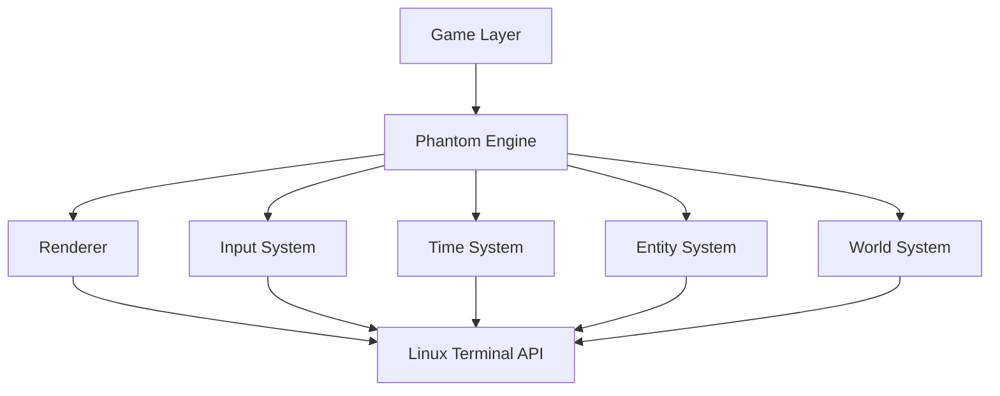

# Engine Architecture

## Overview  
Phantom Engine is designed as a layered architecture.  

Each layer communicates only with the layer below it.  

## Game Layer  
The game layer contains the actual gameplay logic.  
Exmples:  
* Enemies
* Towers
* Player
* Waves
* Rules  

The game should not directly control the terminal.  

---

## Engine Layer  
The engine provides reusable systems:  

* Rendering
* Input Handling
* Timing
* Entity management
* World management  

---

## Terminal Layer  
The lowest layer communicates with the operating system.  

Responsibilities:  
* Cursor movement
* Screen clearing
* Terminal colors
* Keyboard input  

This layer is the only part that should depend on Linux terminal features.