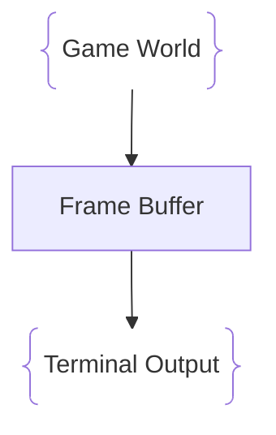

# Renderer
## Purpose
The Renderer is responsible dor drawing the game world.  
Instead of directly printing characters to the terminal, the engine uses a `frameBuffer`.  

## Frame Buffer Concept
The game writes dara into memory first:  

## Advantages
Using a `frameBuffer` allows:  

* Smooth rendering
* Less flickering
* Object layering
* Camera systems
* Effects

## Futurs Features
Planned renderer features:  

* Colored pixels
* Sprites using ASCII characters
* Layers
* Camera movement
* Screen effects