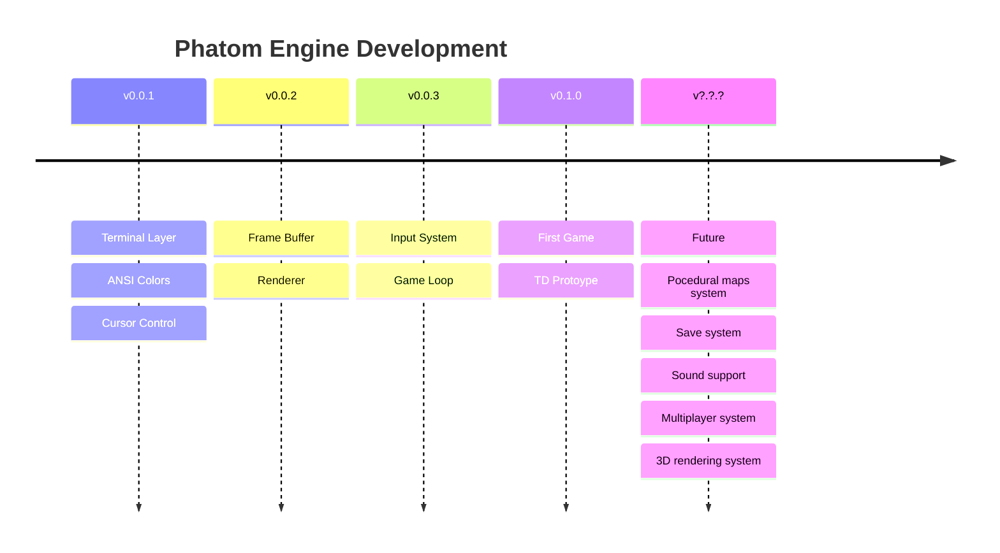

# Roadmap
## Version `0.0.1` - Foundation
Completed:  

- [x] ~~Project cration~~
- [x] ~~Terminal abstraction~~
- [x] ~~ANSI color support~~
- [x] ~~Cursor control~~  

## Version `0.0.2` - Rendering
Planned:  

- [ ] Frame Buffer
- [ ] Pixel structure
- [ ] Renderer module
- [ ] Double buffering

## Verion `0.0.3` - Core Systems
Planned:  

- [ ] Keyboard input
- [ ] Game loop
- [ ] Delat time
- [ ] FPS management

## Version `0.1.0` - First Game
Planned:  

- [ ] Entity system
- [ ] Map system
- [ ] Tower Defense prototype
- [ ] Enemy AI  

## Future
Possible features:  

* Procedural maps
* Save system
* Sound support
* Multiple terminal platforms  

"Just a thought" features:  

* Multiplayer system
* 3D rendering system  

--- 
